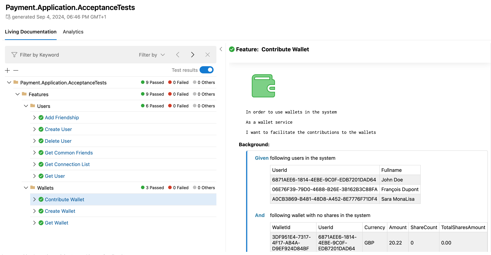

## 🧪 Payment Application Tests

This project ensures robust unit testing using mocking to simulate various scenarios and test the application in isolation.

## 📊 LivingDoc Integration

As part of the Acceptance Testing strategy for the Payment Microservice, LivingDoc is leveraged to visualize and document test scenarios. LivingDoc bridges the gap between human-readable documentation and code, giving insights into the behavior and acceptance criteria of the system.

Using SpecFlow for Behavior-Driven Development (BDD), the tests are written in Gherkin syntax, and LivingDoc turns them into dynamic, interactive documentation.

🔗 [Click here to view the LivingDoc report](./docs/LivingDoc.html)
